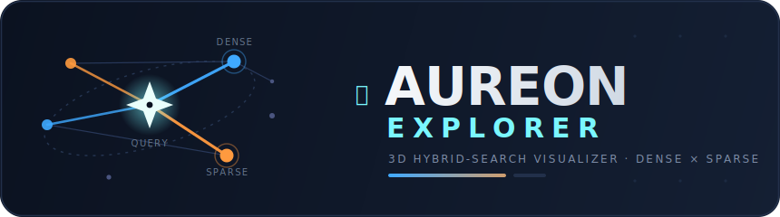

<p align="center">
  
</p>

# ✦ Aureon Explorer — 3D Hybrid-Search Visualizer

[](https://github.com/debaditc/aureon)
[](https://fastapi.tiangolo.com)
[](https://threejs.org)
[](https://opensource.org/licenses/MIT)

A next-gen 3D interface for the [**`aureon`**](https://github.com/debaditc/aureon)
hybrid-search package. Upload documents, index them, and watch retrieval happen as
a **living semantic galaxy**: every document is a glowing node placed by its real
meaning-vector, and each search fires energy beams from a query-star to the top
hits — colored by whether the match was won on **meaning (dense / blue)** or
**exact terms (sparse / orange)** — with the aureon **query router** shown live.

> ### ⭐ Built on Aureon
> This app is a thin visual shell. **All of the retrieval intelligence** — the
> BM25 + LSA dense/sparse retrievers, the 14 fusion methods, the query router, the
> `explain`-mode score breakdown, and the evaluation metrics — comes from the
> **[`aureon`](https://github.com/debaditc/aureon)** package. Aureon Explorer only
> *renders* what aureon computes; it does not modify the package and consumes only
> its public API. **Full credit for the search engine goes to
> [github.com/debaditc/aureon](https://github.com/debaditc/aureon).**

## Prerequisite — install the `aureon` core package

Aureon Explorer is a shell over the [`aureon`](https://github.com/debaditc/aureon)
engine, so **install that package first** — clone it and do an editable install
into the virtualenv you'll use for the app:

```bash
git clone https://github.com/debaditc/aureon.git
cd aureon
pip install -e .
cd ..
```

## Quick start

```bash
git clone https://github.com/debaditc/aureon-explorer.git
cd aureon-explorer
chmod 775 run.sh
./run.sh                 # PORT=9000 ./run.sh for a custom port
```

And then open "http://localhost:8000/" in the browser

`run.sh` creates `.venv`; if the `aureon` core package isn't importable yet it
clones + editable-installs it for you, then installs the app requirements and
starts the server.

Then open http://localhost:8000 and click **Load sample corpus** (or upload your
own `.txt` / `.md` / `.pdf`, or paste text) → **INDEX DOCUMENTS**.

### Manual setup

Prefer to do it by hand? Use **one shared virtualenv** for both packages:

```bash
python3 -m venv .venv && source .venv/bin/activate

# 1) the core engine (editable) — see the Prerequisite above
git clone https://github.com/debaditc/aureon.git
cd aureon && pip install -e . && cd ..

# 2) the app's own dependencies, then run
pip install -r requirements.txt
uvicorn aureon_explorer.server:app --reload
```

`requirements.txt` holds **only the app's** dependencies (FastAPI, Uvicorn,
python-multipart, pypdf). The `aureon` package is installed separately in step 1,
so it must already be present in the active virtualenv before you run the app.

## How it maps to `aureon`

Everything on screen is a projection of an aureon computation:

| UI element                     | `aureon` source                                             |
|--------------------------------|-------------------------------------------------------------|
| Node positions (the galaxy)    | `DenseRetriever._emb` (LSA vectors) → PCA to 3D             |
| Node color (blue ↔ orange)     | per-doc `dense_raw` vs `sparse_raw` from `Explanation`      |
| Node size / beam glow          | `Explanation.fused`                                         |
| Router gauge (α) + lexicality  | `Explanation.alpha`, `Explanation.meta["lexicality"]`      |
| Method buttons (14, grouped)   | `HybridSearch.explain(method=…)` dispatch                  |
| ⚡ latency readout (HUD)        | `aureon.measure()` on the live query                        |
| **⚡ Benchmark** table          | `aureon.evaluate()` + `measure()` + `paired_bootstrap()`    |
| Results list score bars        | `Explanation.top(k)`                                        |

The `aureon` package is **not modified** — the app consumes only its public API
(`HybridSearch.search / explain(..., explain=True)`, `evaluate`, `measure`,
`paired_bootstrap`, and the `Explanation` contract). All app-side evaluation lives
in `aureon_explorer/evaluate.py`.

## Fusion methods (grouped in the left panel)

| Family        | Methods                                                            |
|---------------|-------------------------------------------------------------------|
| retriever     | `bm25` · `dense`                                                   |
| score fusion  | `fixed α` · `combsum` · `combmnz` · `zscore` · `softmax` · `dbsf`  |
| rank fusion   | `rrf` · `wrrf` · `isr` · `borda`                                   |
| routed        | `adaptive` · `adaptive+rrf`                                        |

## ⚡ Benchmark (quality × efficiency)

Click **⚡ BENCHMARK ALL METHODS**. It scores every method on the labeled `aureon`
sample corpus and shows, per method:

- **Quality** — nDCG@10, MRR, MAP, R-Precision, Recall@10, Precision@10 (best per
  column highlighted).
- **Efficiency** — end-to-end query latency (p50 / p95) and throughput (QPS).
- **Δ vs RRF** — nDCG@10 delta with a paired-bootstrap *p*-value (`p<0.10` starred).

> Note: the benchmark and per-query latency are **Python endpoints**, so after
> updating the code you must **restart the server** (`Ctrl-C`, then `./run.sh`) —
> `uvicorn` loads `server.py` once at startup. `304 Not Modified` on the static
> CSS/JS is normal browser caching, not an error.

## Light / dark mode

Toggle with the **☾ / ☀** button in the top bar (persisted in `localStorage`).
Two distinct visual identities, not one inverted into the other:

- **dark** — the night-sky galaxy (additive glow + bloom on black).
- **light** — a *daylight star-chart*: bloom off, glows become saturated inked
  marks, node labels become light paper tags, and the scene sits on a light
  backdrop matched to the fog so the corpus reads as a printed chart.
  `scene.setTheme()` re-skins the scene (including any in-flight search
  beams / star / particles) in place.

Deep-link either with `?theme=light` / `?theme=dark`.

## Deep-linked search

`?q=<query>&method=<method>` runs a search on load once the index is ready — a
shareable link to a specific result. Example:
`/?q=gateway%20GW-09%20timeout&method=adaptive`.

## Try (sample corpus)

- `gateway GW-09 timeout` → router swings **SPARSE** (α≈0.25), top hit doc 6, orange beam.
- `how to lower our public cloud costs` → router leans **DENSE**, cloud-cost docs light up.
- Toggle **rrf / bm25 / dense** or drag **fixed α** → the whole scene re-simulates.

## Architecture

```
aureon-explorer/
├── requirements.txt        installs aureon from github.com/debaditc/aureon
├── run.sh                  venv + deps + uvicorn launcher
└── aureon_explorer/
    ├── server.py           FastAPI: /api/index, /api/sample, /api/search, /api/benchmark, /api/state, SPA
    ├── evaluate.py         quality + efficiency sweep over the aureon public API (used by /api/benchmark)
    ├── ingest.py           .txt/.md/.pdf → text → paragraph chunks
    ├── layout.py           LSA embeddings → 3D PCA coordinates
    └── static/             index.html · styles.css · scene.js (Three.js) · app.js
```

Single-user, in-memory index (POC). Three.js is CDN-loaded — no npm/build step.

## Credits

- **Core search engine:** [`aureon`](https://github.com/debaditc/aureon) — the
  dense + sparse hybrid retrieval, fusion methods, query router, and metrics that
  power everything here. This app would not exist without it.
- **3D rendering:** [Three.js](https://threejs.org) (bloom / post-processing,
  CSS2D labels), loaded from CDN.
- **Web server:** [FastAPI](https://fastapi.tiangolo.com) + [Uvicorn](https://www.uvicorn.org).

## 🔖 Cite

If you use Aureon Explorer, please cite both the visualizer and the **`aureon`**
core engine it is built on:

```bibtex
@misc{aureon_explorer,
  author    = {Debaditya Chakravorty},
  title     = {Aureon Explorer: A 3D Hybrid-Search Visualizer for the Aureon Retrieval Engine},
  year      = {2026},
  publisher = {GitHub},
  url       = {https://github.com/debaditc/aureon-explorer}
}

@misc{aureon,
  author    = {Debaditya Chakravorty},
  title     = {Aureon: Adaptive Unified Retrieval Engine — Dense + Sparse Fusion with a Query Router},
  year      = {2026},
  publisher = {GitHub},
  url       = {https://github.com/debaditc/aureon}
}
```

## License

[MIT](./LICENSE). The bundled/installed [`aureon`](https://github.com/debaditc/aureon)
package is licensed separately under its own repository's terms.
